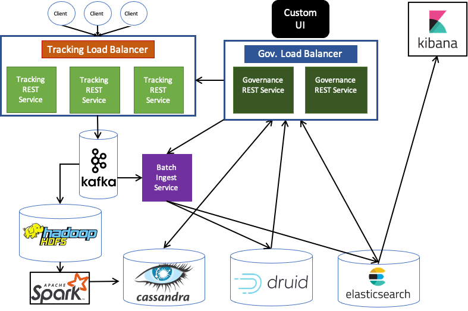

# Analytics backend system

## Requirements

 1. Handle large write volume: Billions of write events per day.
 2. Handle large read/query volume: Millions of merchants wish to gain insight into their business. Read/Query patterns are time-series related metrics.
 3. Provide metrics to customers with at most one hour delay.
 4. Run with minimum downtime.
 5. Have the ability to reprocess historical data in case of bugs in the processing logic.

## Solution

### Components

#### Load Balancer + API Gateway
Load balancer - Probably HA Proxy for high availability load balancing

#### Tracking REST Service
REST Service that receives the tracking beacons, standardizes tracking tags and filters out invalid beacons (Based on governance). Pushes valid beacons to Kafka.
Writes to local ChronicleQueue and then to Kafka. Recovers stream from ChronicleQueue in case of Kafka outage to avoid loss of beacons.

#### Kafka
High-throughput, low-latency distributed messaging system.

#### Governance + Management REST Service
REST Service which exposes management and governance services for the tracking analytics. Exposes APIs to allow management of valid tracking tags, and permissions of publishing tags based on the tools using them.
Eg: For a domain with multiple applications, suggest account_number tag for anyone trying to publish acct_num tag.
This governance leads to low cardinality and efficient resource usage. It also ensures all required tags are vetted by customer teams, and junk data would be minimized.
Additionally, the governance dictates what data is required for what period of time, and what data is required in which forms - Eg: Realtime aggregates, Full-Text searchable, and post processed data in Cassandra

#### Custom UI
Custom UI which has the following:

 - Governance view
	 - To manage tags and the components publishing them
	 - To set retention for the data
	 - To set the requirements of data viewable in the analytics view
 - Analytics view
	 - To view real-time aggregated data from Druid
	 - Search on full text data in Elasticsearch
	 - View processed data from Cassandra

#### Batch Ingest Service
Service that consumes from Kafka and writes only required data into Elasticsearch and Druid based on settings configured in the Governance service

#### Druid
A fast, modern analytics database that allows aggregations while ingesting - This would store only rolled up data.
Would serve requests for all aggregates like - Sum, Count, Average, etc, grouped by several tags in fixed set of dimensions
Druid allows usage of Apache DataSketches to also give approximate unique count, quantiles, most-frequent items

#### HDFS
Hadoop Distributed File System is a distributed file system that handles large data sets running on commodity hardware.
Will store the raw data which would be processed by Spark, and will allow re-processing in case of failures/bugs in processing logic.

#### Spark
Apache Spark is an open-source distributed general-purpose cluster-computing framework. It would be used to process data present in HDFS in batches, aggregating over time windows for larger aggregations. Eg: Tracking user sessions, page drops, etc.

#### Cassandra
Apache Cassandra is a free and open-source, distributed, wide column store, NoSQL database management system designed to handle large amounts of data across many commodity servers.
Cassandra would be used to store the aggregated data produced by Spark jobs, to be be served directly to the Analytics view

#### Elasticsearch + Kibana (Optional)
Elasticsearch is a distributed Search engine based on Lucene. Kibana is an open source data visualization dashboard for Elasticsearch.
Together, they would be used to validate instrumented data and to perform full-text searches on tracking beacons. This allows faster analysis and fixing of any bugs in both the instrumentation or in the processing. Data in Elasticsearch would have a low retention.